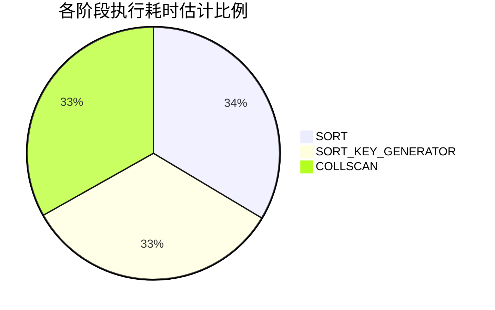
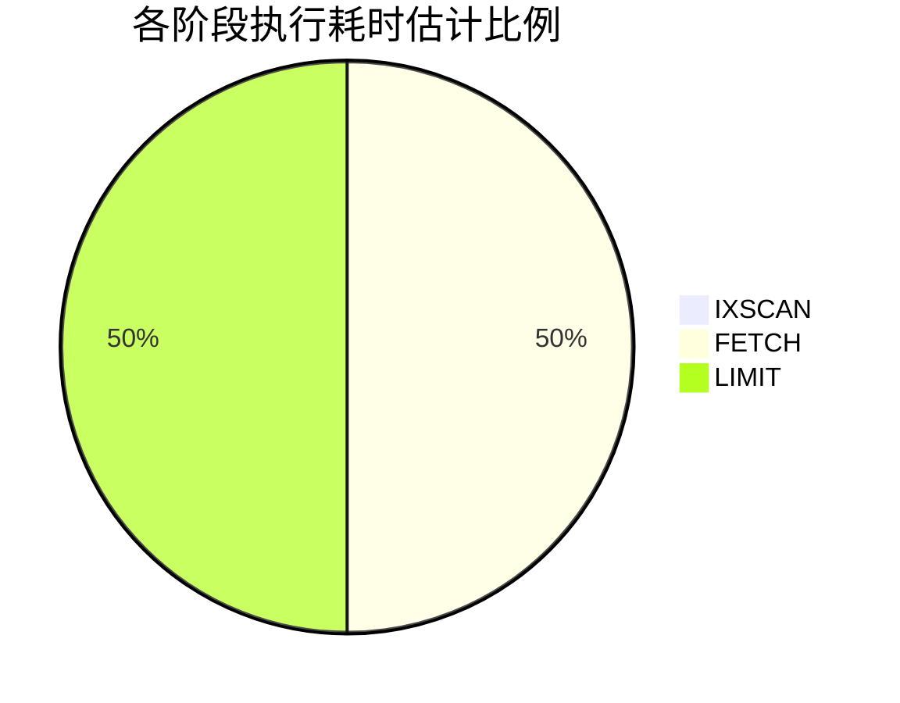

# 目录

[TOC]


# 实验记录 2019-11-08

##可以读dblp的数据

之前尝试使用spark-xml读取dblp的数据，但是读取过程中发生OOM异常。

一次性读取全部dblp数据的代码如下：

```scala
    val df = spark.read
      .format("com.databricks.spark.xml")
      .option("rowTag", "dblp")
      .load("file:///root/dblp.xml")
```

这种读取的方式导致spark的Excutor端生成了过于庞大的SchemaRDD，导致了OOM异常。在查阅了spark-xml的README.md文件后，最终发现了正确的读取方式。


README.md中option支持的选项部分找到关于`rowTag`和`rootTag`的说明：

>* `rowTag`: The row tag of your xml files to treat as a row. For example, in this xml `<books> <book><book> ...</books>`, the appropriate value would be `book`. Default is `ROW`.
>* `rootTag`: The root tag of your xml files to treat as the root. For example, in this xml `<books> <book><book> ...</books>`, the appropriate value would be `books`. Default is `ROWS`.

简单的说`rowTag`选项是用来设置要将什么xml节点转换为DataFrame的row，而`rootTag`用来设置要将根节点设置为哪个节点。

这样就解释了为什么一次性读取dblp的代码会导致OOM异常。因为dblp.xml的根节点是dblp节点，但是却被当成了row。这会在Excutor端生成了一个巨大的RDD对象，导致OOM。


能够不导致OOM的参数设置如下：

```scala
    val df = spark.read
      .format("com.databricks.spark.xml")
      .option("rootTag", "dblp")
 			.option("rowTag", "article")
      .load("file:///root/dblp.xml")
```

避免一次读取全部dblp.xml数据，采用分别读取dblp根节点下的子节点的方式读取。


但是dblp数据集的大小有2g，我们没法知道dblp下一层的子节点都是什么？于是参考了dblp.dtd文件，得知了dblp下的字节点名称。并对各个字节点的记录数量进行了统计。

| subElement    | Count   |
| ------------- | ------- |
| article       | 2093906 |
| inproceedings | 2450274 |
| proceedings   | 41782   |
| book          | 17714   |
| incollection  | 59477   |
| phdthesis     | 73252   |
| mastersthesis | 12      |
| www           | 2346866 |
| person        | 0       |
| data          | 0       |

下一步准备将各个子节点写入单独的xml文件里

#实验记录 2019-11-14

##修改了dblp中的实体定义为latin-1编码

读取文件时发现出现了大量的记录显示corrupt_record

| _corrupt_record | _key | _mdate | _publtype | author | ee   |
| --------------- | ---- | ------ | --------- | ------ | ---- |
|                null|     tr/meltdown/s18|2018-01-07| informal|[Paul Kocher, Dan...|                null|https://spectreat...|
|<article mdate="2...|                null|      null|     null|                null|                null|                null|
|<article mdate="2...|                null|      null|     null|                null|                null|                null|


排查以后发现是由于dblp.xml存在一些xml实体定义导致spark-xml不能正常读取。

```xml
    <article mdate="2017-06-08" key="tr/ibm/IWBS191" publtype="informal">
        <author>Rolf Sander</author>
        <title>Die Repr&auml;sentation r&auml;umlichen Wissens und die Behandlung von Einbettungsproblemen mit Quadtreedepiktionen
        </title>
        <journal>IWBS Report</journal>
        <volume>191</volume>
        <year>1991</year>
        <publisher>IBM Germany Science Center, Institute for Knowledge Based Systems</publisher>
    </article>
```

查阅了spark-xml的readme没有发现可以根据dtd的实体定义替换为对应的latin-1编码字符的方法，于是打算将实体定义相关的字符串用正则表达式匹配并替换。读取dblp.xml替换相应的字符串以后写到dblp_after.xml文件中。

```scala
import java.io.File
import org.apache.spark.sql.SparkSession
object Test4 {
  val s1 = "file:////Users/gaoxin/WorkSpace/spark/dblp.xml"
  //将实体替换以后的dblp写在这里
  val s2 = "file:////Users/gaoxin/WorkSpace/spark/dblp_after.xml"

  def main(args: Array[String]): Unit = {
    val spark = SparkSession
      .builder
      .appName("XML_Test")
      .master("local[*]")
      .getOrCreate()

    val subNode = Array("article")
    
    //文本方式读取
    val file = spark.sparkContext.textFile(s1)

    //转换实体
    val afterParse = file.map(s => ReplaceEntity.parse(s))
    
    //afterParse.foreach(it => println(it))

    val afterParedblp: File = new File(s2)

   if (afterParedblp.isFile) {
     println("delete "+ afterParedblp.delete())
   }

    afterParse.saveAsTextFile(s2)
  }
}
```


**将实体名称替换为实体编号的方式尽管可以在ide下正常显示，但是使用控制台的时候仍然显示乱码。应该替换为具体字符。下面的代码并没有根本地解决问题，以后需要改。**

```scala
import scala.util.matching.Regex

object ReplaceEntity {
  val regex: Regex = new Regex("&[A-Za-z]*;")
  def parse(s: String): String = {
    val optS = regex.replaceAllIn(s, it => it.toString() match {
      case "&reg;" => "&#174;"
      case "&micro;" => "&#181;"
      case "&times;" => "&#215;"
      case "&Agrave;" => "&#192;"
      case "&Aacute;" => "&#193;"
      case "&Acirc;" => "&#194;"
//.....省略
      case _ => {
        println(it)
        it.toString()
      }
    })

    optS
  }
}
```

经过实体替换以后的dblp_after.xml可以正常读取，检查了dataframe的记录也没有发现corrupt_record。

#实验记录 2019-11-21

可以进行简单的查询了

##选取特定的列

```scala
    import spark.implicits._
    dblpArticle.select($"title", $"author", $"url").show()
```

| title                | author               | url                  |
| -------------------- | -------------------- | -------------------- |
| Spectre Attacks: ... | [[Paul Kocher,,],... | null                 |
| Meltdown             | [[Moritz Lipp,,],... | null                 |
| An Evaluation of ... | [[Frank Manola,,]]   | db/labs/gte/index... |

## 根据long类型执行过滤

```scala
import spark.implicits._
dblpArticle.filter($"year" > 2000).show()
```

| title                | author               | year                 |
| -------------------- | -------------------- | -------------------- |
|Spectre Attacks: ...|[[Paul Kocher,,],...|2018|
|            Meltdown|[[Moritz Lipp,,],...|2018|

## 字符串正则匹配

```scala
import spark.implicits._
dblpArticle.select($"title", $"author", $"url").filter($"title" rlike "^Knowledge").show()
```
| title                | author               | year                 |
| -------------------- | -------------------- | -------------------- |
|Knowledge in Oper...|[[Toni Bollinger,...|null|

其他的写在测试代码里了

# 实验记录 2020-02-20

通过docker和docker-compose搭建了实验环境。

1. Mongodb环境
2. Spark和HDFS的环境（可在单机进行伪分布式实验）
3. Hadoop Yarn环境（可在单机进行伪分布式实验）

Spark环境和Hadoop环境是以别人的dockerfile为基础改的这是Github的地址：https://github.com/big-data-europe/docker-hadoop

# 实验记录 2020-02-27

lmh将进行过预处理的数据写入了Mongodb，数据可以正常写入，并通过Mongodb读取。

让xxk学习通过SpringBoot-jpa组件读取Mongodb。

# 实验记录 2020-03-10

将之前的研究成果进行整理

建立远程仓库：https://github.com/FHamster/SparkExp

# 实验记录 2020-03-11

## 发现了title字段空白的错误

翻看mongodb内的数据时发现了严重的错误，大量的title字段一片空白。

排查以后发现是spark-xml推导出了不期望的schema，导致title节点的文本全部没读。

spark-xml推测的schema：

```
root
 |-- _cdate: string (nullable = true)
 |-- _key: string (nullable = true)
 |-- _mdate: string (nullable = true)
 |-- _publtype: string (nullable = true)
 |-- author: array (nullable = true)
 |    |-- element: struct (containsNull = true)
 |    |    |-- _VALUE: string (nullable = true)
 |    |    |-- _aux: string (nullable = true)
 |    |    |-- _orcid: string (nullable = true)
 |-- booktitle: string (nullable = true)
 |-- cdrom: string (nullable = true)
 |-- cite: array (nullable = true)
 |    |-- element: struct (containsNull = true)
 |    |    |-- _VALUE: string (nullable = true)
 |    |    |-- _label: string (nullable = true)
 |-- crossref: string (nullable = true)
 |-- editor: array (nullable = true)
 |    |-- element: struct (containsNull = true)
 |    |    |-- _VALUE: string (nullable = true)
 |    |    |-- _orcid: string (nullable = true)
 |-- ee: array (nullable = true)
 |    |-- element: struct (containsNull = true)
 |    |    |-- _VALUE: string (nullable = true)
 |    |    |-- _type: string (nullable = true)
 |-- journal: string (nullable = true)
 |-- month: string (nullable = true)
 |-- note: array (nullable = true)
 |    |-- element: struct (containsNull = true)
 |    |    |-- _VALUE: string (nullable = true)
 |    |    |-- _type: string (nullable = true)
 |-- number: string (nullable = true)
 |-- pages: string (nullable = true)
 |-- publisher: string (nullable = true)
 |-- title: struct (nullable = true)
 |    |-- _VALUE: string (nullable = true)
 |    |-- _bibtex: string (nullable = true)
 |    |-- i: array (nullable = true)
 |    |    |-- element: string (containsNull = true)
 |    |-- sub: array (nullable = true)
 |    |    |-- element: string (containsNull = true)
 |    |-- sup: array (nullable = true)
 |    |    |-- element: string (containsNull = true)
 |-- url: string (nullable = true)
 |-- volume: string (nullable = true)
 |-- year: long (nullable = true)

```

定位了导致这种现象的xml记录

```xml
<title>&#120001;<sub>0</sub> Regularized Structured Sparsity Convolutional Neural Networks.</title>

<title>Beyond Ohba's Conjecture: A bound on the choice number of <i>k</i>-chromatic graphs with <i>n</i> vertices.</title>

<title>Asynchronous machine vector control: PI<sup>&#945;</sup> controllers for current loops.</title>
```


在dblp网站的显示效果

* **𝓁**0 Regularized Structured Sparsity Convolutional Neural Networks.
* Beyond Ohba's Conjecture: A bound on the choice number of *k*-chromatic graphs with *n* vertices.
* Average dwell time approach to *H*∞ filter for continuous-time switched linear parameter varying systems with time-varying delay.

**发现文章的标题有特殊的文本效果，但是spark-xml在处理时丢失了这部分的语意。需要进行进一步的预处理。并且这意味**

1. 着其他的dblp下的一级字节点也会有这个问题，需要人工设定不少的schema （头疼）
2. 网页显示工作需要加入这种显示功能 （头更疼）


# 实验记录 2020-04-08

## 尝试解决title空白问题，未成功

尝试手动设定schema以后仍然产生这样的现象，**效果不好**

```json
[
  {
    "title": " Transferability of Adversarial Examples to Attack Cloud-based Image Classifier Service."
  },
  {
    "title": "! and ? - Storage as Tensorial Strength."
  },
  {
    "title": "!MDP Playground: Meta-Features in Reinforcement Learning."
  },
  {
    "title": "\""
  },
  {
    "title": "\""
  },
  {
    "title": "\""
  },
  //这里省略
  [
  {
    "title": "\uD83D\uDC4D as social support: Relational closeness, automaticity, and interpreting social support from paralinguistic digital affordances in social media."
  },
  {
    "title": "\uD835\uDD43"
  },
  {
    "title": "\uD835\uDD3D"
  },
  {
    "title": "\uD835\uDD3D"
  },
  {
    "title": "\uD835\uDCDE(k)-robust spanners in one dimension."
  },
  {
    "title": "\uD835\uDCC1"
  },
  {
    "title": "\uD835\uDCC1"
  },
  {
    "title": "\uD835\uDCC1"
  },
  {
    "title": "\uD835\uDCC1"
  },
  {
    "title": "\uD835\uDCC1"
  },
  {
    "title": "\uD835\uDCB1\uD835\uDCB0-smoothness and proximal point results for some nonconvex functions."
  },
  {
    "title": "\uD835\uDCAB-schemes and Deterministic Polynomial Factoring over Finite Fields."
  },
  {
    "title": "픽"
  },
  {
    "title": "풟-stability performance analysis and stabilization of Sun-Earth "
  },
  {
    "title": "풞-Consistency in signed total graphs of commutative rings."
  }
]
]
```

目前计划通过正则表达式替换```<sub>``` ```<sup>``` ```<i>```这样的标签，在成功读取为dataframe以后再通过dataframe中进行字符串替换

## 对title字段的一些发现

```
 |-- title: struct (nullable = true)
 |    |-- _VALUE: string (nullable = true)
 |    |-- _bibtex: string (nullable = true)
 |    |-- i: array (nullable = true)
 |    |    |-- element: string (containsNull = true)
 |    |-- sub: array (nullable = true)
 |    |    |-- element: string (containsNull = true)
 |    |-- sup: array (nullable = true)
 |    |    |-- element: string (containsNull = true)
```

```_VALUE```:title的文本

```i```:斜体
```sup```:上标
```sub```:下标

```_bibtex```:使用bibtex语法描述的title

```tt```:补充的

# 实验记录 2020-04-16

通过替换标签字符串的方式解决了title空白问题。

开始尝试将所有dblp下的子节点写入mongodb

写入成功，目前在检查有没有信息丢失情况。


# 进展简报

已经完成了dblp全量写入mongodb数据库的工作，现在正在检查有没有数据出错的情况。

林谋瀚和高昕正在进行数据检查，还有思考优化查询优化的策略。我们目前的想法有引入杜威编码的方向、以空间换时间的方向、还有借助mongodb的索引的方向。

谢旭坤和张欣现在在进行SpringBoot查询mongodb的探索。

由于目前实验条件的限制，没有服务器集群可以使用。所以目前先用的是docker在个人电脑搭建伪分布式实验环境。现在有三套docker环境：

1. Mongodb环境
2. Spark和HDFS的环境
3. Hadoop Yarn环境

代码托管至github: https://github.com/FHamster/SparkExp.git


# 实验记录 2020-05-10

发现spark-xml进行数据模式推导的结果不是很统一。为了方便服务器取数据，我们手工设定Dataframe的schema。如下是article手工设定的Dataframe数据模式。除此之外也设置了其他的，比如inproceedings、proceedings等。

```scala
  //设定article schema的scala代码
  val articleSchema:StructType = new StructType(Array(
    StructField("_cdate", StringType, nullable = true),
    StructField("_key", StringType, nullable = true),
    StructField("_mdate", StringType, nullable = true),
    StructField("_publtype", StringType, nullable = true),
    StructField("author", ArrayType(
      StructType(Array(
        StructField("_VALUE", StringType, nullable = true),
        StructField("_orcid", StringType, nullable = true),
        StructField("_aux", StringType, nullable = true)
      )), containsNull = true)
    ),
    StructField("booktitle", StringType, nullable = true),
    StructField("cdrom", StringType, nullable = true),
    StructField("cite", ArrayType(
      StructType(Array(
        StructField("_VALUE", StringType, nullable = true),
        StructField("_label", StringType, nullable = true)
      )), containsNull = true)
    ),
    StructField("crossref", StringType, nullable = true),
    StructField("editor", ArrayType(
      StructType(Array(
        StructField("_VALUE", StringType, nullable = true),
        StructField("_orcid", StringType, nullable = true)
      )), containsNull = true)
    ),
    StructField("ee", ArrayType(
      StructType(Array(
        StructField("_VALUE", StringType, nullable = true),
        StructField("_type", StringType, nullable = true)
      )), containsNull = true)
    ),
    StructField("journal", StringType, nullable = true),
    StructField("month", StringType, nullable = true),
    StructField("note", ArrayType(
      StructType(Array(
        StructField("_VALUE", StringType, nullable = true),
        StructField("_type", StringType, nullable = true)
      )), containsNull = true)
    ),
    StructField("number", StringType, nullable = true),
    StructField("pages", StringType, nullable = true),
    StructField("publisher", StringType, nullable = true),
    StructField("title", StructType(Array(
      StructField("_VALUE", StringType, nullable = true),
      StructField("_bibtex", StringType, nullable = true),
    )), nullable = true),
    StructField("url", StringType, nullable = true),
    StructField("volume", StringType, nullable = true),
    StructField("year", LongType, nullable = true)
  ))
```

# 实验记录 2020-05-12

为了能够得到一份DBLP的所有author的列表我们在mongodb新建了一个author文档。并将作者信息导入，并进行去重。

```scala
//这里将作者信息导入author文档
test("article") {
    import com.databricks.spark.xml._
    val subnode = "article"
    val ss: SparkSession = SparkSession
      .builder
      .appName("Write_article")
      .master("local[*]")
      .config("spark.mongodb.output.uri", s"mongodb://127.0.0.1/SparkDBLPTest.Property.Author")
      .getOrCreate()

    val opt = ss.read
      .option("rootTag", "dblp")
      .option("rowTag", subnode)
      .schema(PropertiesObj.articleSchema)
      .xml(PropertiesObj.wholeDBLP_cvtSparkPath)

    import ss.implicits._
    val res = opt
      .select(explode($"author") as "author")
      .select($"author._VALUE" as "_VALUE",
        $"author._orcid" as "_orcid",
        $"author._aux" as "_aux"
      ).distinct()
      .sort($"_VALUE")

    println(s"write $subnode into mongodb")
    MongoSpark.save(res)
    ss.stop()
  }

//这里对author文档进行去重操作
test("distinct author") {
    import com.mongodb.spark.config._
    val sparkSession: SparkSession = SparkSession
      .builder
      .appName("in")
      .master("local[*]")
      .config("spark.mongodb.output.uri", s"mongodb://127.0.0.1/SparkDBLPTest.Property.Author")
      .config("spark.mongodb.input.uri", s"mongodb://127.0.0.1/SparkDBLPTest.Property.Author")
      .getOrCreate()

    import com.mongodb.spark.config._
    import sparkSession.implicits._
    val customReadConfig = ReadConfig(Map(
      "readPreference.name" -> "secondaryPreferred"),
      Some(ReadConfig(sparkSession)))
    val df = sparkSession.read.format("mongo").options(customReadConfig.asOptions).load()

    println(df.count())
    val df2 = df.dropDuplicates("_VALUE")
      .select($"_VALUE", $"_orcid")
      .cache()
    println(df2.count())
    df2.show(100)
    import com.mongodb.spark.config._

    MongoSpark.save(df2.write.option("collection", "Property.Author").mode("overwrite"))
  }
```


#  实验记录 2020-05-25

##一些mongodb查询语句的例子

根据字符串字段进行正则匹配

```json
{'title': cloud}
```

根据字符串字段进行正则匹配

```json
{'title': /cloud/i}
```

根据数组内的元素进行精确匹配

```json
{'author._VALUE': "Joon Sun Park"}
```

根据数组内的元素进行正则匹配

```json
{'author._VALUE': /Park/i}
```

根据数组内元素进行一组正则条件的匹配

```json
{
	'author._VALUE': {
		$in: [/Park/i, /Mike/i]
	}
}
```

# 实验记录 2020-06-28

##UI可以用了

我们已经将mongodb-SpringBoot-Vue连接起来了，我们现在只做了article文档的部分查询操作。

通过SpringDataMongoDB执行查询操作。

article实体类的定义

```java
package cn.jmu.spark_dblp.server.entity;

import cn.jmu.spark_dblp.server.entity.sub.*;
import lombok.Data;
import org.springframework.data.annotation.Id;
import org.springframework.data.mongodb.core.mapping.Document;
import org.springframework.data.mongodb.core.mapping.Field;

import java.util.List;

@Document(collection = "article")
@Data
public class Article {
    @Id
    protected String _id;
    @Field
    private String _cdate;
    @Field
    private String _key;
    @Field
    private String _mdate;
    @Field
    private String _publtype;
    @Field
    private List<property.Author> author;
    @Field
    private String booktitle;
    @Field
    private String cdrom;
    @Field
    private List<Cite> cite;
    @Field
    private String crossref;
    @Field
    private List<Editor> editor;
    @Field
    private List<Ee> ee;
    @Field
    private String journal;
    @Field
    private String month;
    @Field
    private List<Note> note;
    @Field
    private String publisher;
    @Field
    private String title;
    @Field
    private String url;
    @Field
    private String volume;
    @Field
    private Long year;
}
```

article的查询方法。SpringData系列的ORM框架API风格统一，并且API设计上有Hibernate的影子。这给予在写简单查询语句时很大的方便。

```java
package cn.jmu.spark_dblp.server.dao;

import cn.jmu.spark_dblp.server.entity.Article;
import cn.jmu.spark_dblp.server.entity.sub.Property.Author;
import org.springframework.data.mongodb.repository.Query;
import org.springframework.data.repository.CrudRepository;
import org.springframework.stereotype.Repository;

import java.util.List;
import java.util.regex.Pattern;
import java.util.stream.Stream;

@Repository
public interface ArticleDAO extends CrudRepository<Article, String> {
  	//根据作者进行匹配，这种查询是精确匹配，并且传入参数的设置比较麻烦。不太实用不予采用
    List<Article> findAllByAuthorContaining(List<property.Author> author);

  	//与上一个查询方法类似
    Stream<Article> findAllByAuthorContaining(property.Author author);

  	//这个是手工设定的MongoDB查询语句，但是他还结合了一些SpEL在里面。
  	//目前对article三条件查询是基于这个实现的
  	//由于三个条件可能缺失，这个语句很丑，我正在寻求写得好看的方法
  	//由于可能需要对返回的数据进行简单的规约后再给前端，所以返回的是一个Stream
    @Query("{" +
            "title: ?#{ [0].isEmpty() ?  {$exists :true} : {$regex: [0], $options: '$i'} }," +
            "'author._VALUE': ?#{ [1].size()==0 ?  {$exists :true} : {$in:[1]} }," +
            "'year': ?#{ [2].size()==0 ? {$exists :true} : {$in: [2]}  }"+
            "}")
    Stream<Article> findAllByTitleContainingAndAuthor__VALUEContainingAndYearIn(
            String title,
            List<Pattern> author,
            List<Integer> year
    );

  	//根据作者的精确查找
    @Query("{'author._VALUE': ?0}")
    Stream<Article> findAllByAuthorContainingAccurate(String author);

  	//根据标题的模糊查找，没怎么用到
    @Query("{title: ?#{ [0].isEmpty() ?  abc : {$regex: [0], $options: '$i'} }}")
    Stream<Article> findAllByTitleContaining(String title);

}

```

Controller部分的没什么好说的，省略。仅说明部分的http API

对article进行多条件筛选，查询条件通过json传输

```
POST http://host:port/article/search
```

对作者进行精确搜索

```
GET http://host:port/article/accurateAuthor?author={}
```

对作者进行模糊搜索

```
POST http://host:port/authors?_VALUE={}
```

## UI演示图片


# 实验记录 2020-06-30

发现提交返回较多结果的查询（大约500条返回结果）时延迟时间已经长到无法容忍，排查后发现主要的时间消耗在对大量数据的传输上。我们目前打算进行分页处理，限制返回的结果。

# 实验记录 2020-07-13

我们需要对数据进行分类，分类关键字是每个子节点的名称和_publitype属性。在此记录导入各个子节点的mongodb集合的group运算结果。

##article

```json
[
  {
    "prefix1": "journals/",
    "_publtype": "informal"
  },
  {
    "prefix1": "journals/",
    "_publtype": "edited"
  },
  {
    "prefix1": "journals/",
    "_publtype": "data"
  },
  {
    "prefix1": "journals/",
    "_publtype": "software"
  },
  {
    "prefix1": "journals/"
  },
  {
    "prefix1": "journals/",
    "_publtype": "survey"
  },
  {
    "prefix1": "journals/",
    "_publtype": "informal withdrawn"
  },
  {
    "prefix1": "conf/"
  },
  {
    "prefix1": "tr/",
    "_publtype": "informal"
  },
  {
    "prefix1": "dblpnote/",
    "_publtype": "informal"
  },
  {
    "prefix1": "journals/",
    "_publtype": "withdrawn"
  },
  {
    "prefix1": "persons/",
    "_publtype": "informal"
  },
  {
    "prefix1": "persons/"
  }
]
```

## book

```json
[
  {
    "prefix1": "phd/"
  },
  {
    "prefix1": "tr/"
  },
  {
    "prefix1": "persons/"
  },
  {
    "prefix1": "conf/"
  },
  {
    "prefix1": "books/",
    "_publtype": "habil"
  },
  {
    "prefix1": "phd/",
    "_publtype": "habil"
  },
  {
    "prefix1": "series/",
    "_publtype": "informal"
  },
  {
    "prefix1": "series/"
  },
  {
    "prefix1": "series/",
    "_publtype": "withdrawn"
  },
  {
    "prefix1": "books/"
  },
  {
    "prefix1": "reference/"
  }
]
```

## incollection

```json
[
  {
    "prefix1": "series/"
  },
  {
    "prefix1": "conf/"
  },
  {
    "prefix1": "books/"
  },
  {
    "prefix1": "journals/"
  },
  {
    "prefix1": "reference/"
  },
  {
    "prefix1": "books/",
    "_publtype": "encyclopedia"
  },
  {
    "prefix1": "reference/",
    "_publtype": "encyclopedia"
  },
  {
    "prefix1": "series/",
    "_publtype": "withdrawn"
  },
  {
    "prefix1": "series/",
    "_publtype": "encyclopedia"
  }
]
```

## inproceedings

```json
[
  {
    "prefix1": "series/"
  },
  {
    "prefix1": "conf/"
  },
  {
    "prefix1": "journals/"
  },
  {
    "prefix1": "www/"
  },
  {
    "prefix1": "persons/"
  },
  {
    "prefix1": "conf/",
    "_publtype": "withdrawn"
  },
  {
    "prefix1": "conf/",
    "_publtype": "informal"
  },
  {
    "prefix1": "journals/",
    "_publtype": "informal"
  },
  {
    "prefix1": "journals/",
    "_publtype": "withdrawn"
  }
]
```


## masterthesis

```json
[
  {
    "prefix1": "ms/"
  },
  {
    "prefix1": "phd/"
  }
]
```

## phdthesis

```json
[
  {
    "prefix1": "phd/"
  },
  {
    "prefix1": "series/"
  },
  {
    "prefix1": "books/"
  },
  {
    "prefix1": "phd/",
    "_publtype": "withdrawn"
  }
]
```

## proceedings

```json
[
  {
    "prefix1": "conf/",
    "_publtype": "withdrawn"
  },
  {
    "prefix1": "tr/",
    "_publtype": "informal"
  },
  {
    "prefix1": "conf/"
  },
  {
    "prefix1": "journals/"
  },
  {
    "prefix1": "reference/"
  },
  {
    "prefix1": "books/"
  },
  {
    "prefix1": "series/"
  }
]
```

## all InOne

```json
[
  {
    "prefix1": "reference/",
    "_publtype": "encyclopedia",
    "type_xml": "type_xml"
  },
  {
    "prefix1": "series/",
    "_publtype": "withdrawn",
    "type_xml": "type_xml"
  },
  {
    "prefix1": "books/",
    "type_xml": "type_xml"
  },
  {
    "prefix1": "reference/",
    "type_xml": "type_xml"
  },
  {
    "prefix1": "tr/",
    "type_xml": "type_xml"
  },
  {
    "prefix1": "journals/",
    "type_xml": "type_xml"
  },
  {
    "prefix1": "journals/",
    "_publtype": "edited",
    "type_xml": "type_xml"
  },
  {
    "prefix1": "conf/",
    "_publtype": "withdrawn",
    "type_xml": "type_xml"
  },
  {
    "prefix1": "phd/",
    "type_xml": "type_xml"
  },
  {
    "prefix1": "books/",
    "_publtype": "encyclopedia",
    "type_xml": "type_xml"
  },
  {
    "prefix1": "conf/",
    "_publtype": "informal",
    "type_xml": "type_xml"
  },
  {
    "prefix1": "journals/",
    "_publtype": "informal",
    "type_xml": "type_xml"
  },
  {
    "prefix1": "dblpnote/",
    "_publtype": "informal",
    "type_xml": "type_xml"
  },
  {
    "prefix1": "tr/",
    "_publtype": "informal",
    "type_xml": "type_xml"
  },
  {
    "prefix1": "series/",
    "type_xml": "type_xml"
  },
  {
    "prefix1": "journals/",
    "_publtype": "data",
    "type_xml": "type_xml"
  },
  {
    "prefix1": "series/",
    "_publtype": "informal",
    "type_xml": "type_xml"
  },
  {
    "prefix1": "series/",
    "_publtype": "encyclopedia",
    "type_xml": "type_xml"
  },
  {
    "prefix1": "ms/",
    "type_xml": "type_xml"
  },
  {
    "prefix1": "persons/",
    "type_xml": "type_xml"
  },
  {
    "prefix1": "www/",
    "type_xml": "type_xml"
  },
  {
    "prefix1": "phd/",
    "_publtype": "withdrawn",
    "type_xml": "type_xml"
  },
  {
    "prefix1": "conf/",
    "type_xml": "type_xml"
  },
  {
    "prefix1": "journals/",
    "_publtype": "survey",
    "type_xml": "type_xml"
  },
  {
    "prefix1": "journals/",
    "_publtype": "withdrawn",
    "type_xml": "type_xml"
  },
  {
    "prefix1": "phd/",
    "_publtype": "habil",
    "type_xml": "type_xml"
  },
  {
    "prefix1": "books/",
    "_publtype": "habil",
    "type_xml": "type_xml"
  },
  {
    "prefix1": "persons/",
    "_publtype": "informal",
    "type_xml": "type_xml"
  },
  {
    "prefix1": "journals/",
    "_publtype": "software",
    "type_xml": "type_xml"
  },
  {
    "prefix1": "journals/",
    "_publtype": "informal withdrawn",
    "type_xml": "type_xml"
  }
]
```

#实验记录 2020-07-14

经过对查询类型的分析，决定对如下字段建立索引

* title（过滤关键字并且执行查询多为模糊匹配）
* author._VALUE(过滤、聚合常用关键字，通常执行精确匹配)
* year（排序常用关键字）
* Prefix2（过滤常用关键字）

选定了几种查询，通过mongodb的explain()API评估查询耗时。

onlydoc是将article、inproceedings、proceedings、book、incollection、phdthesis、mastersthesis进行合并形成的集合。文档总数为5,146,977。

## title（未建立任何索引）

### 查询分析命令结果

`db.onlyDoc.find({title: /spark/i}).sort({year: 1})`是一个常见的查询，根据title进行模糊匹配并根据year排序。

我们使用一个正则匹配`/spark/i`作为查询关键字，这个查询将返回1,575个文档。

查询命令：`db.onlyDoc.find({title: /spark/i}).sort({year: 1})`

显示查询、执行计划命令：`db.onlyDoc.explain("allPlansExecution").find({title: /spark/i}).sort({year: 1})`

```json
[
  {
    "executionStats": {
      "executionSuccess": true,
      "nReturned": 1,
      "executionTimeMillis": 31866,
      "totalKeysExamined": 0,
      "totalDocsExamined": 5146977,
      "executionStages": {
        "stage": "SORT",
        "nReturned": 1,
        "executionTimeMillisEstimate": 3752,
        "works": 5146982,
        "advanced": 1,
        "needTime": 5146980,
        "needYield": 0,
        "saveState": 40242,
        "restoreState": 40242,
        "isEOF": 1,
        "sortPattern": {
          "year": 1
        },
        "memUsage": 597,
        "memLimit": 33554432,
        "limitAmount": 1,
        "inputStage": {
          "stage": "SORT_KEY_GENERATOR",
          "nReturned": 1575,
          "executionTimeMillisEstimate": 3716,
          "works": 5146980,
          "advanced": 1575,
          "needTime": 5145404,
          "needYield": 0,
          "saveState": 40242,
          "restoreState": 40242,
          "isEOF": 1,
          "inputStage": {
            "stage": "COLLSCAN",
            "filter": {
              "title": {
                "$regex": "spark",
                "$options": "i"
              }
            },
            "nReturned": 1575,
            "executionTimeMillisEstimate": 3706,
            "works": 5146979,
            "advanced": 1575,
            "needTime": 5145403,
            "needYield": 0,
            "saveState": 40242,
            "restoreState": 40242,
            "isEOF": 1,
            "direction": "forward",
            "docsExamined": 5146977
          }
        }
      },
      "allPlansExecution": []
    },
    "ok": 1,
    "queryPlanner": {
      "plannerVersion": 1,
      "namespace": "SparkDBLPTest.onlyDoc",
      "indexFilterSet": false,
      "parsedQuery": {
        "title": {
          "$regex": "spark",
          "$options": "i"
        }
      },
      "winningPlan": {
        "stage": "SORT",
        "sortPattern": {
          "year": 1
        },
        "limitAmount": 1,
        "inputStage": {
          "stage": "SORT_KEY_GENERATOR",
          "inputStage": {
            "stage": "COLLSCAN",
            "filter": {
              "title": {
                "$regex": "spark",
                "$options": "i"
              }
            },
            "direction": "forward"
          }
        }
      },
      "rejectedPlans": []
    },
    "serverInfo": {
      "host": "51c90cc27037",
      "port": 27017,
      "version": "4.2.6",
      "gitVersion": "20364840b8f1af16917e4c23c1b5f5efd8b352f8"
    }
  }
]
```

查询命令：`db.onlyDoc.find({title: /spark/i})`

显示查询、执行计划命令：`db.onlyDoc.explain("allPlansExecution").find({title: /spark/i})`

```json
[
  {
    "executionStats": {
      "executionSuccess": true,
      "nReturned": 1,
      "executionTimeMillis": 406,
      "totalKeysExamined": 0,
      "totalDocsExamined": 1484,
      "executionStages": {
        "stage": "LIMIT",
        "nReturned": 1,
        "executionTimeMillisEstimate": 298,
        "works": 1486,
        "advanced": 1,
        "needTime": 1484,
        "needYield": 0,
        "saveState": 14,
        "restoreState": 14,
        "isEOF": 1,
        "limitAmount": 1,
        "inputStage": {
          "stage": "COLLSCAN",
          "filter": {
            "title": {
              "$regex": "spark",
              "$options": "i"
            }
          },
          "nReturned": 1,
          "executionTimeMillisEstimate": 298,
          "works": 1485,
          "advanced": 1,
          "needTime": 1484,
          "needYield": 0,
          "saveState": 14,
          "restoreState": 14,
          "isEOF": 0,
          "direction": "forward",
          "docsExamined": 1484
        }
      },
      "allPlansExecution": []
    },
    "ok": 1,
    "queryPlanner": {
      "plannerVersion": 1,
      "namespace": "SparkDBLPTest.onlyDoc",
      "indexFilterSet": false,
      "parsedQuery": {
        "title": {
          "$regex": "spark",
          "$options": "i"
        }
      },
      "winningPlan": {
        "stage": "LIMIT",
        "limitAmount": 1,
        "inputStage": {
          "stage": "COLLSCAN",
          "filter": {
            "title": {
              "$regex": "spark",
              "$options": "i"
            }
          },
          "direction": "forward"
        }
      },
      "rejectedPlans": []
    },
    "serverInfo": {
      "host": "51c90cc27037",
      "port": 27017,
      "version": "4.2.6",
      "gitVersion": "20364840b8f1af16917e4c23c1b5f5efd8b352f8"
    }
  }
]
```


###分析

`db.onlyDoc.find({title: /spark/i}).sort({year: 1})`是一个典型的查询语句，根据执行计划显示的内容

> executionStats.executionTimeMillis:31866
>
> executionStats.totalDocsExamined:5146977

该查询语句耗费了大量时间，总共执行时间大约31秒。造成大量时间耗费的是原因是排序操作频繁的进行IO。执行阶段为如下三个过程




相比之下，`db.onlyDoc.find({title: /A/})`的执行却花费了极少时间。按照执行阶段的估计值来看，该查询应该也需要花费大约10秒的时间。但是实际上花费的时间却非常少

> executionStats.executionTimeMillis:406

原因是该查询执行了两个阶段


由于只需要获取较少数量的结果（由LIMIT阶段决定这个结果的数量）并且不需要进行排序操作，表扫描（COLLSCAN）阶段只需要花费很少的时间，搜集到满足LIMIT阶段所规定数量的文档就可以完成查询任务。

###结论

避免执行排序关键字未建立索引的sort操作，以免延长查询时间。

##title（year字段建立单值索引）

根据title（未建立任何索引）的查询分析结果，`db.onlyDoc.find({title: /spark/i}).sort({year: 1})`的时间约66%花费在排序上。因此首先在year建立索引。year为long类型数据，比较适合建立单值索引。

### 查询分析命令结果

查询命令：`db.onlyDoc.find({title: /spark/i}).sort({year: 1})`

显示查询、执行计划命令：`db.onlyDoc.explain("allPlansExecution").find({title: /spark/i}).sort({year: 1})`

```json
[
  {
    "executionStats": {
      "executionSuccess": true,
      "nReturned": 1,
      "executionTimeMillis": 52,
      "totalKeysExamined": 4521,
      "totalDocsExamined": 4521,
      "executionStages": {
        "stage": "LIMIT",
        "nReturned": 1,
        "executionTimeMillisEstimate": 5,
        "works": 4522,
        "advanced": 1,
        "needTime": 4520,
        "needYield": 0,
        "saveState": 35,
        "restoreState": 35,
        "isEOF": 1,
        "limitAmount": 1,
        "inputStage": {
          "stage": "FETCH",
          "filter": {
            "title": {
              "$regex": "spark",
              "$options": "i"
            }
          },
          "nReturned": 1,
          "executionTimeMillisEstimate": 5,
          "works": 4521,
          "advanced": 1,
          "needTime": 4520,
          "needYield": 0,
          "saveState": 35,
          "restoreState": 35,
          "isEOF": 0,
          "docsExamined": 4521,
          "alreadyHasObj": 0,
          "inputStage": {
            "stage": "IXSCAN",
            "nReturned": 4521,
            "executionTimeMillisEstimate": 0,
            "works": 4521,
            "advanced": 4521,
            "needTime": 0,
            "needYield": 0,
            "saveState": 35,
            "restoreState": 35,
            "isEOF": 0,
            "keyPattern": {
              "year": 1
            },
            "indexName": "year_1",
            "isMultiKey": false,
            "multiKeyPaths": {
              "year": []
            },
            "isUnique": false,
            "isSparse": false,
            "isPartial": false,
            "indexVersion": 2,
            "direction": "forward",
            "indexBounds": {
              "year": ["[MinKey, MaxKey]"]
            },
            "keysExamined": 4521,
            "seeks": 1,
            "dupsTested": 0,
            "dupsDropped": 0
          }
        }
      },
      "allPlansExecution": []
    },
    "ok": 1,
    "queryPlanner": {
      "plannerVersion": 1,
      "namespace": "SparkDBLPTest.onlyDoc",
      "indexFilterSet": false,
      "parsedQuery": {
        "title": {
          "$regex": "spark",
          "$options": "i"
        }
      },
      "winningPlan": {
        "stage": "LIMIT",
        "limitAmount": 1,
        "inputStage": {
          "stage": "FETCH",
          "filter": {
            "title": {
              "$regex": "spark",
              "$options": "i"
            }
          },
          "inputStage": {
            "stage": "IXSCAN",
            "keyPattern": {
              "year": 1
            },
            "indexName": "year_1",
            "isMultiKey": false,
            "multiKeyPaths": {
              "year": []
            },
            "isUnique": false,
            "isSparse": false,
            "isPartial": false,
            "indexVersion": 2,
            "direction": "forward",
            "indexBounds": {
              "year": ["[MinKey, MaxKey]"]
            }
          }
        }
      },
      "rejectedPlans": []
    },
    "serverInfo": {
      "host": "51c90cc27037",
      "port": 27017,
      "version": "4.2.6",
      "gitVersion": "20364840b8f1af16917e4c23c1b5f5efd8b352f8"
    }
  }
]
```

### 分析

可以看出，`db.onlyDoc.find({title: /spark/i}).sort({year: 1})`是由于year字段上索引的建立，查询总时间从

**31866显著降低到52**，降低到原来的0.1%。

> executionStats.executionTimeMillis:52
>
> executionStats.totalKeysExamined:4521
>
> executionStats.totalDocsExamined:4521

该查询语句执行阶段为如下三个过程




由于在year建立的索引，执行排序操作通过执行索引扫描（IXSCAN）在很短时间内就完成了。主要的时间都花在根据排序结果寻找对应数据上。

###结论

在排序关键字建立索引可以显著增加查询速度

##title（title建立单值索引，year建立单值索引）

### 查询分析命令结果

查询命令：`db.onlyDoc.find({title: /spark/i}).sort({year: 1})`

显示查询、执行计划命令：`db.onlyDoc.explain("allPlansExecution").find({title: /spark/i}).sort({year: 1})`

```json
[
  {
    "executionStats": {
      "executionSuccess": true,
      "nReturned": 1,
      "executionTimeMillis": 51,
      "totalKeysExamined": 4521,
      "totalDocsExamined": 4521,
      "executionStages": {
        "stage": "LIMIT",
        "nReturned": 1,
        "executionTimeMillisEstimate": 0,
        "works": 4522,
        "advanced": 1,
        "needTime": 4520,
        "needYield": 0,
        "saveState": 70,
        "restoreState": 70,
        "isEOF": 1,
        "limitAmount": 1,
        "inputStage": {
          "stage": "FETCH",
          "filter": {
            "title": {
              "$regex": "spark",
              "$options": "i"
            }
          },
          "nReturned": 1,
          "executionTimeMillisEstimate": 0,
          "works": 4521,
          "advanced": 1,
          "needTime": 4520,
          "needYield": 0,
          "saveState": 70,
          "restoreState": 70,
          "isEOF": 0,
          "docsExamined": 4521,
          "alreadyHasObj": 0,
          "inputStage": {
            "stage": "IXSCAN",
            "nReturned": 4521,
            "executionTimeMillisEstimate": 0,
            "works": 4521,
            "advanced": 4521,
            "needTime": 0,
            "needYield": 0,
            "saveState": 70,
            "restoreState": 70,
            "isEOF": 0,
            "keyPattern": {
              "year": 1
            },
            "indexName": "year_1",
            "isMultiKey": false,
            "multiKeyPaths": {
              "year": []
            },
            "isUnique": false,
            "isSparse": false,
            "isPartial": false,
            "indexVersion": 2,
            "direction": "forward",
            "indexBounds": {
              "year": ["[MinKey, MaxKey]"]
            },
            "keysExamined": 4521,
            "seeks": 1,
            "dupsTested": 0,
            "dupsDropped": 0
          }
        }
      },
      "allPlansExecution": [
        {
          "nReturned": 1,
          "executionTimeMillisEstimate": 0,
          "totalKeysExamined": 4521,
          "totalDocsExamined": 4521,
          "executionStages": {
            "stage": "LIMIT",
            "nReturned": 1,
            "executionTimeMillisEstimate": 0,
            "works": 4521,
            "advanced": 1,
            "needTime": 4520,
            "needYield": 0,
            "saveState": 70,
            "restoreState": 70,
            "isEOF": 1,
            "limitAmount": 1,
            "inputStage": {
              "stage": "FETCH",
              "filter": {
                "title": {
                  "$regex": "spark",
                  "$options": "i"
                }
              },
              "nReturned": 1,
              "executionTimeMillisEstimate": 0,
              "works": 4521,
              "advanced": 1,
              "needTime": 4520,
              "needYield": 0,
              "saveState": 70,
              "restoreState": 70,
              "isEOF": 0,
              "docsExamined": 4521,
              "alreadyHasObj": 0,
              "inputStage": {
                "stage": "IXSCAN",
                "nReturned": 4521,
                "executionTimeMillisEstimate": 0,
                "works": 4521,
                "advanced": 4521,
                "needTime": 0,
                "needYield": 0,
                "saveState": 70,
                "restoreState": 70,
                "isEOF": 0,
                "keyPattern": {
                  "year": 1
                },
                "indexName": "year_1",
                "isMultiKey": false,
                "multiKeyPaths": {
                  "year": []
                },
                "isUnique": false,
                "isSparse": false,
                "isPartial": false,
                "indexVersion": 2,
                "direction": "forward",
                "indexBounds": {
                  "year": ["[MinKey, MaxKey]"]
                },
                "keysExamined": 4521,
                "seeks": 1,
                "dupsTested": 0,
                "dupsDropped": 0
              }
            }
          }
        },
        {
          "nReturned": 0,
          "executionTimeMillisEstimate": 3,
          "totalKeysExamined": 4520,
          "totalDocsExamined": 0,
          "executionStages": {
            "stage": "SORT",
            "nReturned": 0,
            "executionTimeMillisEstimate": 3,
            "works": 4521,
            "advanced": 0,
            "needTime": 4521,
            "needYield": 0,
            "saveState": 70,
            "restoreState": 70,
            "isEOF": 0,
            "sortPattern": {
              "year": 1
            },
            "memUsage": 0,
            "memLimit": 33554432,
            "limitAmount": 1,
            "inputStage": {
              "stage": "SORT_KEY_GENERATOR",
              "nReturned": 0,
              "executionTimeMillisEstimate": 3,
              "works": 4521,
              "advanced": 0,
              "needTime": 4521,
              "needYield": 0,
              "saveState": 70,
              "restoreState": 70,
              "isEOF": 0,
              "inputStage": {
                "stage": "FETCH",
                "nReturned": 0,
                "executionTimeMillisEstimate": 3,
                "works": 4520,
                "advanced": 0,
                "needTime": 4520,
                "needYield": 0,
                "saveState": 70,
                "restoreState": 70,
                "isEOF": 0,
                "docsExamined": 0,
                "alreadyHasObj": 0,
                "inputStage": {
                  "stage": "IXSCAN",
                  "filter": {
                    "title": {
                      "$regex": "spark",
                      "$options": "i"
                    }
                  },
                  "nReturned": 0,
                  "executionTimeMillisEstimate": 3,
                  "works": 4520,
                  "advanced": 0,
                  "needTime": 4520,
                  "needYield": 0,
                  "saveState": 70,
                  "restoreState": 70,
                  "isEOF": 0,
                  "keyPattern": {
                    "title": 1
                  },
                  "indexName": "title_1",
                  "isMultiKey": false,
                  "multiKeyPaths": {
                    "title": []
                  },
                  "isUnique": false,
                  "isSparse": false,
                  "isPartial": false,
                  "indexVersion": 2,
                  "direction": "forward",
                  "indexBounds": {
                    "title": ["[\"\", {})", "[/spark/i, /spark/i]"]
                  },
                  "keysExamined": 4520,
                  "seeks": 1,
                  "dupsTested": 0,
                  "dupsDropped": 0
                }
              }
            }
          }
        }
      ]
    },
    "ok": 1,
    "queryPlanner": {
      "plannerVersion": 1,
      "namespace": "SparkDBLPTest.onlyDoc",
      "indexFilterSet": false,
      "parsedQuery": {
        "title": {
          "$regex": "spark",
          "$options": "i"
        }
      },
      "winningPlan": {
        "stage": "LIMIT",
        "limitAmount": 1,
        "inputStage": {
          "stage": "FETCH",
          "filter": {
            "title": {
              "$regex": "spark",
              "$options": "i"
            }
          },
          "inputStage": {
            "stage": "IXSCAN",
            "keyPattern": {
              "year": 1
            },
            "indexName": "year_1",
            "isMultiKey": false,
            "multiKeyPaths": {
              "year": []
            },
            "isUnique": false,
            "isSparse": false,
            "isPartial": false,
            "indexVersion": 2,
            "direction": "forward",
            "indexBounds": {
              "year": ["[MinKey, MaxKey]"]
            }
          }
        }
      },
      "rejectedPlans": [
        {
          "stage": "SORT",
          "sortPattern": {
            "year": 1
          },
          "limitAmount": 1,
          "inputStage": {
            "stage": "SORT_KEY_GENERATOR",
            "inputStage": {
              "stage": "FETCH",
              "inputStage": {
                "stage": "IXSCAN",
                "filter": {
                  "title": {
                    "$regex": "spark",
                    "$options": "i"
                  }
                },
                "keyPattern": {
                  "title": 1
                },
                "indexName": "title_1",
                "isMultiKey": false,
                "multiKeyPaths": {
                  "title": []
                },
                "isUnique": false,
                "isSparse": false,
                "isPartial": false,
                "indexVersion": 2,
                "direction": "forward",
                "indexBounds": {
                  "title": ["[\"\", {})", "[/spark/i, /spark/i]"]
                }
              }
            }
          }
        }
      ]
    },
    "serverInfo": {
      "host": "51c90cc27037",
      "port": 27017,
      "version": "4.2.6",
      "gitVersion": "20364840b8f1af16917e4c23c1b5f5efd8b352f8"
    }
  }
]
```

### 分析

可以看出，`db.onlyDoc.find({title: /spark/i}).sort({year: 1})`没有由于额外的title字段上的单值索引的建立显著减少查询总时间。虽然查询计划由使用title的索引的打算，但是执行时并没有使用title上的单值索引。

> executionStats.executionTimeMillis:51
>
> executionStats.totalKeysExamined:4521
>
> executionStats.totalDocsExamined:4521


## title（仅title建立单值索引）

###查询分析命令结果

查询命令：`db.onlyDoc.find({title: /spark/i}).sort({year: 1})`

显示查询、执行计划命令：`db.onlyDoc.explain("allPlansExecution").find({title: /spark/i}).sort({year: 1})`

```json
[
  {
    "executionStats": {
      "executionSuccess": true,
      "nReturned": 1,
      "executionTimeMillis": 38403,
      "totalKeysExamined": 5146977,
      "totalDocsExamined": 1575,
      "executionStages": {
        "stage": "SORT",
        "nReturned": 1,
        "executionTimeMillisEstimate": 4885,
        "works": 5146981,
        "advanced": 1,
        "needTime": 5146979,
        "needYield": 0,
        "saveState": 40240,
        "restoreState": 40240,
        "isEOF": 1,
        "sortPattern": {
          "year": 1
        },
        "memUsage": 597,
        "memLimit": 33554432,
        "limitAmount": 1,
        "inputStage": {
          "stage": "SORT_KEY_GENERATOR",
          "nReturned": 1575,
          "executionTimeMillisEstimate": 4864,
          "works": 5146979,
          "advanced": 1575,
          "needTime": 5145403,
          "needYield": 0,
          "saveState": 40240,
          "restoreState": 40240,
          "isEOF": 1,
          "inputStage": {
            "stage": "FETCH",
            "nReturned": 1575,
            "executionTimeMillisEstimate": 4839,
            "works": 5146978,
            "advanced": 1575,
            "needTime": 5145402,
            "needYield": 0,
            "saveState": 40240,
            "restoreState": 40240,
            "isEOF": 1,
            "docsExamined": 1575,
            "alreadyHasObj": 0,
            "inputStage": {
              "stage": "IXSCAN",
              "filter": {
                "title": {
                  "$regex": "spark",
                  "$options": "i"
                }
              },
              "nReturned": 1575,
              "executionTimeMillisEstimate": 3604,
              "works": 5146978,
              "advanced": 1575,
              "needTime": 5145402,
              "needYield": 0,
              "saveState": 40240,
              "restoreState": 40240,
              "isEOF": 1,
              "keyPattern": {
                "title": 1
              },
              "indexName": "title_1",
              "isMultiKey": false,
              "multiKeyPaths": {
                "title": []
              },
              "isUnique": false,
              "isSparse": false,
              "isPartial": false,
              "indexVersion": 2,
              "direction": "forward",
              "indexBounds": {
                "title": ["[\"\", {})", "[/spark/i, /spark/i]"]
              },
              "keysExamined": 5146977,
              "seeks": 1,
              "dupsTested": 0,
              "dupsDropped": 0
            }
          }
        }
      },
      "allPlansExecution": []
    },
    "ok": 1,
    "queryPlanner": {
      "plannerVersion": 1,
      "namespace": "SparkDBLPTest.onlyDoc",
      "indexFilterSet": false,
      "parsedQuery": {
        "title": {
          "$regex": "spark",
          "$options": "i"
        }
      },
      "winningPlan": {
        "stage": "SORT",
        "sortPattern": {
          "year": 1
        },
        "limitAmount": 1,
        "inputStage": {
          "stage": "SORT_KEY_GENERATOR",
          "inputStage": {
            "stage": "FETCH",
            "inputStage": {
              "stage": "IXSCAN",
              "filter": {
                "title": {
                  "$regex": "spark",
                  "$options": "i"
                }
              },
              "keyPattern": {
                "title": 1
              },
              "indexName": "title_1",
              "isMultiKey": false,
              "multiKeyPaths": {
                "title": []
              },
              "isUnique": false,
              "isSparse": false,
              "isPartial": false,
              "indexVersion": 2,
              "direction": "forward",
              "indexBounds": {
                "title": ["[\"\", {})", "[/spark/i, /spark/i]"]
              }
            }
          }
        }
      },
      "rejectedPlans": []
    },
    "serverInfo": {
      "host": "51c90cc27037",
      "port": 27017,
      "version": "4.2.6",
      "gitVersion": "20364840b8f1af16917e4c23c1b5f5efd8b352f8"
    }
  }
]
```

### 分析

仅建立title的单值索引时，查询时间甚至从31866增加到38403。title的索引几乎全被匹配了一遍。

###结论

单值索引不能很好的帮助匹配模糊查询的请求。


## title（仅建立文本索引）

### 查询分析命令结果

查询命令：`db.onlyDoc.find({$text: {$search: "spark"}}).sort({year: 1})`

显示查询、执行计划命令：`db.onlyDoc.explain("allPlansExecution").find({$text: {$search: "spark"}}).sort({year: 1})`

```json
[
  {
    "executionStats": {
      "executionSuccess": true,
      "nReturned": 1,
      "executionTimeMillis": 18,
      "totalKeysExamined": 1415,
      "totalDocsExamined": 1415,
      "executionStages": {
        "stage": "SORT",
        "nReturned": 1,
        "executionTimeMillisEstimate": 0,
        "works": 1419,
        "advanced": 1,
        "needTime": 1417,
        "needYield": 0,
        "saveState": 11,
        "restoreState": 11,
        "isEOF": 1,
        "sortPattern": {
          "year": 1
        },
        "memUsage": 597,
        "memLimit": 33554432,
        "limitAmount": 1,
        "inputStage": {
          "stage": "SORT_KEY_GENERATOR",
          "nReturned": 1415,
          "executionTimeMillisEstimate": 0,
          "works": 1417,
          "advanced": 1415,
          "needTime": 1,
          "needYield": 0,
          "saveState": 11,
          "restoreState": 11,
          "isEOF": 1,
          "inputStage": {
            "stage": "TEXT",
            "nReturned": 1415,
            "executionTimeMillisEstimate": 0,
            "works": 1416,
            "advanced": 1415,
            "needTime": 0,
            "needYield": 0,
            "saveState": 11,
            "restoreState": 11,
            "isEOF": 1,
            "indexPrefix": {
            },
            "indexName": "title_text",
            "parsedTextQuery": {
              "terms": ["spark"],
              "negatedTerms": [],
              "phrases": [],
              "negatedPhrases": []
            },
            "textIndexVersion": 3,
            "inputStage": {
              "stage": "TEXT_MATCH",
              "nReturned": 1415,
              "executionTimeMillisEstimate": 0,
              "works": 1416,
              "advanced": 1415,
              "needTime": 0,
              "needYield": 0,
              "saveState": 11,
              "restoreState": 11,
              "isEOF": 1,
              "docsRejected": 0,
              "inputStage": {
                "stage": "FETCH",
                "nReturned": 1415,
                "executionTimeMillisEstimate": 0,
                "works": 1416,
                "advanced": 1415,
                "needTime": 0,
                "needYield": 0,
                "saveState": 11,
                "restoreState": 11,
                "isEOF": 1,
                "docsExamined": 1415,
                "alreadyHasObj": 0,
                "inputStage": {
                  "stage": "OR",
                  "nReturned": 1415,
                  "executionTimeMillisEstimate": 0,
                  "works": 1416,
                  "advanced": 1415,
                  "needTime": 0,
                  "needYield": 0,
                  "saveState": 11,
                  "restoreState": 11,
                  "isEOF": 1,
                  "dupsTested": 1415,
                  "dupsDropped": 0,
                  "inputStage": {
                    "stage": "IXSCAN",
                    "nReturned": 1415,
                    "executionTimeMillisEstimate": 0,
                    "works": 1416,
                    "advanced": 1415,
                    "needTime": 0,
                    "needYield": 0,
                    "saveState": 11,
                    "restoreState": 11,
                    "isEOF": 1,
                    "keyPattern": {
                      "_fts": "text",
                      "_ftsx": 1
                    },
                    "indexName": "title_text",
                    "isMultiKey": true,
                    "isUnique": false,
                    "isSparse": false,
                    "isPartial": false,
                    "indexVersion": 2,
                    "direction": "backward",
                    "indexBounds": {
                    },
                    "keysExamined": 1415,
                    "seeks": 1,
                    "dupsTested": 1415,
                    "dupsDropped": 0
                  }
                }
              }
            }
          }
        }
      },
      "allPlansExecution": []
    },
    "ok": 1,
    "queryPlanner": {
      "plannerVersion": 1,
      "namespace": "SparkDBLPTest.onlyDoc",
      "indexFilterSet": false,
      "parsedQuery": {
        "$text": {
          "$search": "spark",
          "$language": "english",
          "$caseSensitive": false,
          "$diacriticSensitive": false
        }
      },
      "winningPlan": {
        "stage": "SORT",
        "sortPattern": {
          "year": 1
        },
        "limitAmount": 1,
        "inputStage": {
          "stage": "SORT_KEY_GENERATOR",
          "inputStage": {
            "stage": "TEXT",
            "indexPrefix": {
            },
            "indexName": "title_text",
            "parsedTextQuery": {
              "terms": ["spark"],
              "negatedTerms": [],
              "phrases": [],
              "negatedPhrases": []
            },
            "textIndexVersion": 3,
            "inputStage": {
              "stage": "TEXT_MATCH",
              "inputStage": {
                "stage": "FETCH",
                "inputStage": {
                  "stage": "OR",
                  "inputStage": {
                    "stage": "IXSCAN",
                    "keyPattern": {
                      "_fts": "text",
                      "_ftsx": 1
                    },
                    "indexName": "title_text",
                    "isMultiKey": true,
                    "isUnique": false,
                    "isSparse": false,
                    "isPartial": false,
                    "indexVersion": 2,
                    "direction": "backward",
                    "indexBounds": {
                    }
                  }
                }
              }
            }
          }
        }
      },
      "rejectedPlans": []
    },
    "serverInfo": {
      "host": "51c90cc27037",
      "port": 27017,
      "version": "4.2.6",
      "gitVersion": "20364840b8f1af16917e4c23c1b5f5efd8b352f8"
    }
  }
]
```

###分析

文本索引确实起到了作用，查询时间由原来的31866显著下降至20，原来的0.06%。相比单独建立year单值索引，文本索引的查询话费从52减少到20，为原先的38.46%


但是查询返回的文档数量却减少为1415，使用模糊匹配的值则为1,575。原因是因为文本索引是根据单词建立的。所以会出现下面的情况：

> A 6-bit 0.81-mW 700-MS/s SAR ADC With Sparkle-Code Correction, Resolution Enhancement, and Background Window Width Calibration.

文本索引不会命中该字符串，因为Sparkle不被认为匹配Spark。但是Sparkle会被认为匹配/spark/i。

### 结论

文本索引更显著的减少了查询返回的时间，**但是并不是执行真正的模糊匹配查询**。

Tip：文本索引不支持排序

> Sort operations cannot obtain sort order from a `text` index, even from a [compound text index](https://docs.mongodb.com/manual/core/index-text/#text-index-compound); i.e. sort operations cannot use the ordering in the text index.
>
> [MongoDB Documentation](https://docs.mongodb.com/manual/core/index-text/#restrictions)

##对比title和year上的四种索引方案

首先驳回对title建立单值索引的方案，反向优化。

对于在year建立单值索引的优化方案，当出现`/A/i`这类匹配结果特别多的查询时，查询速度**仍然会慢到无法容忍**。

对于分别在year和title建立的方案，这个方案**没有显著优于year单独建立索引的方案**。

对于在title建立文本索引的方案，该方案**耗费时间最少，但是并不执行真正的模糊匹配**。


###决策

目前打算，用户第一次搜索时默认使用文本索引进行查询，再之后由用户选择是否执行模糊匹配。

```
db.onlyDoc.createIndex({title: "text"});
```

